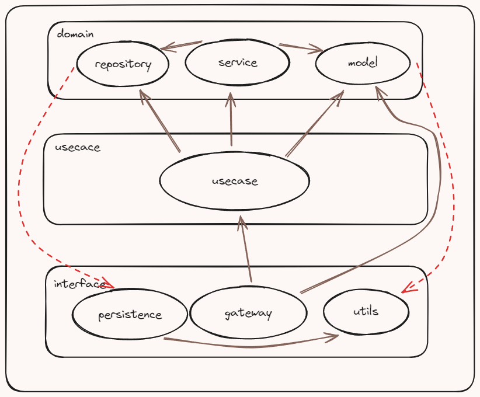

# 项目简介
tiktok是基于接口定义实现相对应功能的微服务项目
# 项目架构
- 整体借鉴了整洁架构的思想，对项目进行分层。
- 尽可能的保持了单一职责的原则来设计接口，以及通过适当的抽象来实现依赖分离，从而实现了底层实现的可替代性。
- 比如，在本项目中如果你不想使用mysql，你想练习一下新学的的pgsql，那么你就可以在database包中实现repository抽象出来的接口,然后只需要在inject中修改两三行代码，你就可以完成mysql->pgsql的转换，而不用修改除了一个数据库应该做的之外的任何事情。
- 基于以上想法，如果你能保证不同服务的持久化之间不存在依赖关系，你甚至可以模块A使用mysql，模块B使用pgsql。当然，这需要你自己确保数据之间不存在依赖关系。

**注:**
1. 棕色线条是依赖指向，在整洁架构中内层(高层)不得依赖于外层(低层)
2. 红色线条指向接口的具体实现




# 项目结构
```text
├─app                    # 项目主要实现部分
│  ├─domain              # 实体层
│  │  ├─model            # model定义被可被复用或需要抽象的接口
│  │  │  └─errno         # 被整个项目使用的错误处理
│  │  ├─repository       # 定义持久化的接口
│  │  └─service          # 核心业务处理
│  │      ├─chat
│  │      ├─interaction
│  │      ├─relation
│  │      ├─user
│  │      └─video
│  ├─interface           # 接口层，转换数据的格式，使数据可以在整个项目中流动
│  │  ├─gateway          # 网关
│  │  │  ├─handler
│  │  │  ├─middleware
│  │  │  ├─pack
│  │  │  ├─router
│  │  │  └─rpc           # rpc-client
│  │  └─persistence      # 持久化，实现repository中定义的接口以完成依赖反转
│  │      ├─cache        # 缓存
│  │      └─database     # db
│  └─usecase             # 用例层，衔接起interface与domain，简单的业务处理
│      └─pack
├─cmd                    # 项目启动
│  ├─gateway
│  ├─interaction
│  │  └─pack
│  ├─relation
│  │  └─pack
│  ├─user
│  │  └─pack
│  └─video
│      └─pack
├─config
│  ├─conf
│  └─sql                 # 初始化表等信息
├─consts
├─idl
│  └─script
├─kitex_gen
├─pkg
    ├─discovery          # 服务注册
    ├─inject             # 依赖注入
    ├─kafka
    ├─log
    ├─oss
    ├─registry           # 服务发现
    ├─snowflake
    └─utils


```

# 文档
[项目报告](https://o0e45m7p53e.feishu.cn/docx/I2p2dZaPIoYuJQxPmprc4krbnqL)

[部署文档](https://o0e45m7p53e.feishu.cn/docx/R8ybdyX1XoKlYIxlXhYcPm33nRY)
